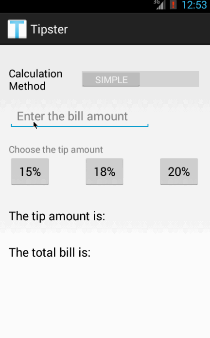

# Tipster app for Android

This is an Android application to calculate the tip amount based on the customer's preferred tip percentage.

Time spent: 18 hours spent in total

Completed user stories:

 * [x] Required: User is displayed the tip of specified percentage for specified entered amount
 * [x] Required: User enters the total amount of the transaction
 * [x] Required: User can select between tip amounts (i.e. 10%, 15%, 20%)
 * [x] Required: Upon selecting tip amount, formatted tip value is displayed
 * [x] Optional: User begins typing a new bill amount and old tip and total amounts are cleared
 * [x] Optional: User can input subtotal and tax to get tip based on subtotal
 * [x] Optional: User can input tax to get total amount based on subtotal plus tip and tax
 * [x] Optional: User can choose between simple tip calculator and complex (based on subtotal) tip calculator
 
Notes:

Created a second activity to allow user to switch between simple tip calculation and complex tip calculation

Walkthrough of all user stories:

GIF created with [LiceCap](http://www.cockos.com/licecap/).
